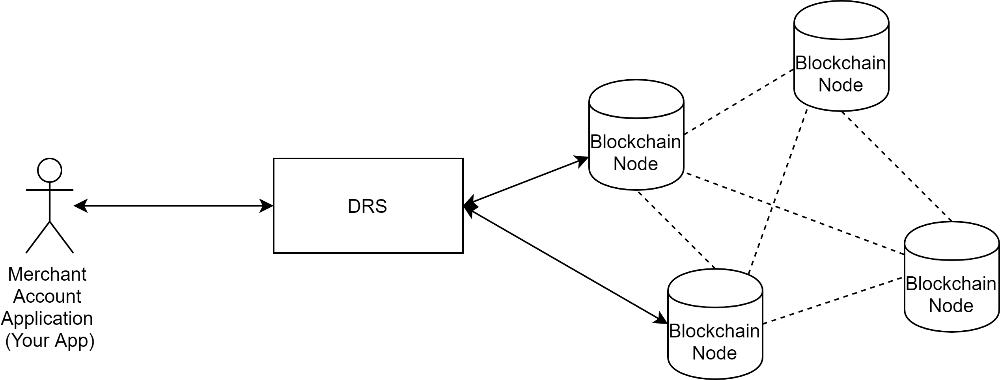

# STACS Settlity - Sample Application
Settlity is a Permissioned Blockchain Network built and managed by Hashstacs that exposes HTTP REST API endpoints for applications to connect and interact with the underlying distributed ledger, the Stacs blockchain. This sample application contains all essential tools for communicating with a node residing within Settlity including encryption of HTTP requests and decryption of HTTP responses since encryption in transit is enforced.

STACS enables business applications to sit on top of Settlity and run business processes by invoking smart contract functions linked to the underlying hosted blockchain infrastructure.

The provided sample application here has several examples illustrating how business applications can send transaction requests to Settlity and includes sample code for encryption and decryption of HTTP API messages.

Reach out to the Support team at Stacs for questions at support@stacs.io

## Table of Contents
* [Getting Started](#getting-started) 
  * [Pre-requisites](#pre-requisites)
    * [Application Requirements](#application-requirements)
    * [Settlity Network Requirements (3 steps)](#settlity-network-requirements)
* [STACS Blockchain Introduction](#stacs-blockchain-introduction)
* [STACS DRS HTTP API Workflow](#stacs-drs-http-api-workflow)
  * [API Request Encryption](#api-request-encryption) 
  * [API Request Decryption](#api-request-decryption)
  * [API Request Header and Body Construction](#api-request-header-and-body-construction)
  * [Transaction Request Flow to and from the Network](#transaction-request-flow-to-and-from-the-network)
* [STACS DRS HTTP REST APIs](#stacs-drs-http-rest-apis)
* [Settlity Message Type (SMT)](#settlity-message-type-(smt))

## Getting Started
To begin, please ensure that you have both the Application Requirements and Settlity Network Requirements completed before you embark on this journey.

### Pre-requisites
#### Application Requirements
To run the application, you will need:
- JDK 8 and higher
- MySQL 5.7 and above
- Maven
- Lombok (on your IDE)
- Create an empty database schema (`helloworld` is the schema name in this sample. To change the db connection details, go to `application.yml`)
```
CREATE DATABASE `helloworld` CHARACTER SET 'utf8mb4' COLLATE 'utf8mb4_general_ci';
```  

#### Settlity Network Requirements

You will need to register for a merchant account before you can send the sample API calls to the network successfully. The following describes the steps you will need to take in order to start interfacing with Settlity.

##### 1. Create a RSA asymmetric key pair 
Before you register, you will need to first create an RSA asymmetric key pair.
There are 2 ways to do so described in greater detail below, refer to Option 2 the recommended approach due to its simplicity.

###### Option 1. Generate a RSA private key and public key with openssl commands

* Generate a RSA Private Key:
```
    openssl genrsa -out rsa_private_key.pem 1024    
```
* Convert the traditional format private key into PKCS#8 format (this Java sample application requires the private key to be encoded by PKCS#8)
```
openssl pkcs8 -topk8 -inform PEM -in rsa_private_key.pem -outform PEM -nocrypt
```
* Generate the RSA Public Key:
```
openssl rsa -in rsa_private_key.pem -pubout -out rsa_public_key.pem
```
###### Option 2. Run the sample application (provided you meet the Application Requirements) and use the built-in UI to generate the key pair
* Run the application
* Once the application is running successfully, proceed to the built-in provided Frontend UI at `localhost:18080/swagger-ui.html`
* You should see a list of sample APIs using the Swagger 2 format
* Go to the Utility : Utils Controller and click on Expand Operations. 
* Click on the `Try it out!` button and your keypair will be generated in the Response Body shown in the diagram below.
   


##### 2. Setup an available API endpoint to receive callbacks
Settlity and the underlying blockchain network has an additional layer, the DRS module (see [STACS Blockchain Introduction](#STACS-Blockchain-Introduction)) which supports the asynchronous ability to send back transaction status and details once your transaction requests have been completed at the data consensus layer of the blockchain.
This provides this sample application with a robust, real-time update on transaction requests.

You will need to setup a HTTP API endpoint in order to receive callbacks in real-time. 

##### 3. Request for a merchant account with the Support team

Details required by the Support team are as follows:
* Your RSA Public Key
* API Endpoint for receiving callbacks

Once processed, you should receive the following merchant information:
* DRS API URL
* DRS Public Key
* Merchant Id

In your application's `application.yml`, please update the `helloworld.drs` parameters:

`application.yml` parameter | merchant information
------------------------- | --------------------
|url | DRS API URL|
|publicKey | DRS Public Key|
|myPublicKey | Your RSA Public Key|
|myPrivateKey | Your RSA Private Key|
|myIdentifierId | Merchant Id|

##### 4. Good to Go!
Congratulations! 

You are now good to start working with the APIs within this sample application. 
Once the application is running, you can use the built-in Swagger UI on your browser, which defaults to [localhost:18080/swagger-ui.html](localhost:18080/swagger-ui.html).


## STACS Blockchain Introduction
Settlity is a managed blockchain service that hosts several nodes of the Stacs blockchain and a Domain Runtime System (DRS) application.


The DRS has a multi-tenant architecture that manages API calls from business applications to the underlying blockchain nodes.
This includes authorization of 3rd party developers and securing API requests to the blockchain by enforcing security-in-transit with encrypted HTTP requests to the blockchain.
The DRS enables hosting and management of multiple nodes to support High Availability. 
 
 ## STACS DRS HTTP API Workflow

The DRS enhances security before the blockchain layer by enforcing encryption in transit of remote API requests from incoming business applications.
These business applications will also need to utilize their registered merchant RSA private key to sign on all API requests which the DRS validates to ensure that incoming API requests originate from the authorized merchant accounts.

The following encryption and decryption methods are already provided in the [DrsClient.java](io.stacs.dapp.helloworld.httpclient.DrsClient) `post(String url, Object request)` method.

### API Request Encryption  
 
Steps:
1. Generate a AES-256 Key on the fly 
2. Encrypt the Message Request Body with the generated AES-256 key 
3. Encrypt the AES-256 key with the DRS public key 
4. Create a signature using your Merchant private key
5. Create the Message Request Header that contains:
  a. Merchant id
  b. encrypted AES-256 key
  c. signature
6. Construct the final API Message with both the header and encrypted body

Code Sample in `DrsClient.java`:
```
byte[] requestBytes = JSON.toJSONString(request).getBytes(DEFAULT_CHARSET);
//Generate AES Key 
String aesKey = AESUtil.generateKey256();
//Encrypt Request body with AES key
byte[] encryptedData = AESUtil.encryptBinary(requestBytes, aesKey);
//Encrypt AES key with DRS public key
String encryptAesKey = RsaEncryptUtil.base64Byte2string(RsaEncryptUtil.encryptByPublicKeyString(aesKey, CONFIG.getPublicKey()));
//Create request signature using Merchant private key
String signature = RsaSignUtil.sign(encryptedData, CONFIG.getMyPrivateKey());

Request.Builder requestBuilder = new Request.Builder();
//1.Request Header Setup
requestBuilder
        .addHeader("identifierId", CONFIG.getMyIdentifierId())
        .addHeader("aesKey", encryptAesKey)
        .addHeader("signature", signature);
//2. Add encrypted Request body
RequestBody body = RequestBody.create(MEDIA_TYPE_JSON, encryptedData);
//3. Create HTTP Request
Request req = requestBuilder
        .url(url)
        .post(body)
        .build();
Response response = CLIENT.newCall(req).execute();
```
### API Response Decryption

1. extract header from the Response and get the 
  a. encrypted AES-256 key
  b. signature
2. Validate the signature with the DRS public key 
3. Decrypt the AES-256 key with your Merchant private key
4. Use the AES-256 key to decrypt the Response Body 

Code Sample in `DrsClient.java`:

```
//Extract header from Response
String respIdentifierId = response.header("identifierId");
String respSignatue = response.header("signature");
String respEncryptAesKey = response.header("aesKey");
ResponseBody responseBody = response.body();
byte[] respEncryptedBody = responseBody.bytes();
//Verify Response Signature with DRS public key

if (!RsaSignUtil.check(respEncryptedBody, respSignatue, CONFIG.getPublicKey())) {
    log.error("DRS Signature verification failed.");
    throw new RuntimeException("signature verification error");
}
//Decrypt AES key using Merchant private key
String decryptAesKey = RsaEncryptUtil.byte2string(RsaEncryptUtil.decryptByPrivateKeyString(respEncryptAesKey, CONFIG.getMyPrivateKey()));
//Decrypt Response Body with decrypted AES key
byte[] decryptBytes = AESUtil.decryptBinary(respEncryptedBody, decryptAesKey);
String jsonStringResp = new String(decryptBytes, DEFAULT_CHARSET);
return JSONObject.parseObject(jsonStringResp);
```

### API Request Header and Body Construction

An API Message Request consists of 3 components:
* header
  * smt code - refer to SMT documentation for the relevant code
  * encrypted AES-256 key is embedded here
  * signature with your Merchant private key is embedded here
* body
  * json parameters is dependent on the SMT code used, refer to SMT documentation for the relevant parameters
  * this Request Body is encrypted with the AES-256 key before being sent to the DRS
* trailer

```
{
"header" :{
"messageSenderAddress" : "1c91145f0624245d75288f276547efdaad4a17c2" ,
"identifierId" : "DBOCCNBJ088" ,
"uuid" : "482677b9aa8e48c0abced1d7217756ff" ,
"smtCode" : "smtt-abs-transfer-transfer-1-v1" ,
"sessionId" : "" ,
"messageId" : "" ,
"aeskey": "",
"signature":"",
"version" : ""
},
"body" : {
"assetId" : "C159782357864001000" ,
"targetAddress" : "210188ecc46911f2aa3a1dab43dfd07fec0cb096" ,
"quantity" : 10
},
"trailer" : {
"authenticationTrailer" : "" ,
"blockchainTransaction" : [],
"extraData" : "" ,
"responseCode" : "" ,
"responseMessage" : ""
}
}
```

### Transaction Request Flow to and from the Network 



The overall architecture and sequence of information from your application to the STACS blockchain follows the following steps:
1. Merchant Account Application sends encrypted API Request to the DRS
2. Merchant Account Application receives a synchronous API Response from the DRS indicating if request was receives successfully
3. DRS decrypts and validates signature corresponding to the merchant account


4. DRS sends the Transaction Request to the blockchain network nodes
5. STACS Blockchain reaches consensus on your Transaction Request which is now a Transaction in a Block on the blockchain
6. DRS receives the outcome of the Transaction Request from the STACS Blockchain
7. DRS encrypts the Transaction outcome as an API Response


8. Merchant Account Application received the encrypted API Response from the callback endpoint
9. Merchant Account Application decrypts and validates signature corresponding to the DRS
10. Merchant Account Application retrieves the outcome of the initial API Request (as a Transaction in a Block on the STACS blockchain)

 
## STACS DRS HTTP REST APIs
    
  There are 14 REST API endpoints in total. 
     
  In the file [DrsApiConstant.java](io.stacs.dapp.helloworld.constant.DrsApiConstant.java), you can see 5 available API endpoints exposed by the DRS:
  1. Create a Wallet Address: `/smt/address/create`
  2. Invoke Smart Contract Functions (using SMT format): `/endpoint`
  3. Query Balance of assets in a Wallet Address: `/smt/contract/balanceof`
  4. Query Blockchain Transaction Results: `/smt/message/getByIdentifierIdAndUuid`
  5. Query Addresses and their balance for an Asset: `/v1/smt/query/asset/holders`
  
  There are 9 additional API endpoints not in this sample application:
  
  6. Query list of assets: `/v1/smt/query/asset/list` 
  7. Query details of an asset: `/v1/smt/query/asset/info` 
  8. Query total supply of an asset: `/v1/smt/query/asset/totalSupply` 
  9. Query wallet addresses and their balance for a particular asset: `/v1/smt/query/asset/holders` 
  10. Query total authorized amount of assets for a particular wallet address: `/v1/smt/query/asset/approval` 
  11. Query wallet address identity on the chain: `/v1/smt/query/address/identityinfo` 
  12. Query all assets and balance for a particular wallet: `/v1/smt/query/address/asset/list` 
  13. Query all transactions of an address: `/v1/smt/query/address/txRelation/list` 
  14. Query transaction details by txId: `/v1/smt/query/transaction/info` 
  
  The sample APIs provided in this sample application send the request to 1 of these 5 DRS APIs that are then forwarded to the Settlity.
  Sample APIs in the Swagger UI demonstrate use of the above APIs with the SMT format.
  
  Do reach out to the Settlity support team for more information on all API endpoints and their parameters. 
  
## Settlity Message Type (SMT) - Smart Contract Function Format
  Settlity Message Type (SMT) is an additional layer built into the API endpoints to encapsulate smart contract functions and their required parameters to make it easy for business applications to invoke.
     
  Smart contracts uploaded to the blockchain are mapped to a SMT format so that smart contract function parameters are standardized.  
  
  Do reach out to the Settlity support team for detailed documentation on how to use the SMT format to invoke smart contract function calls to Settlity.
    
